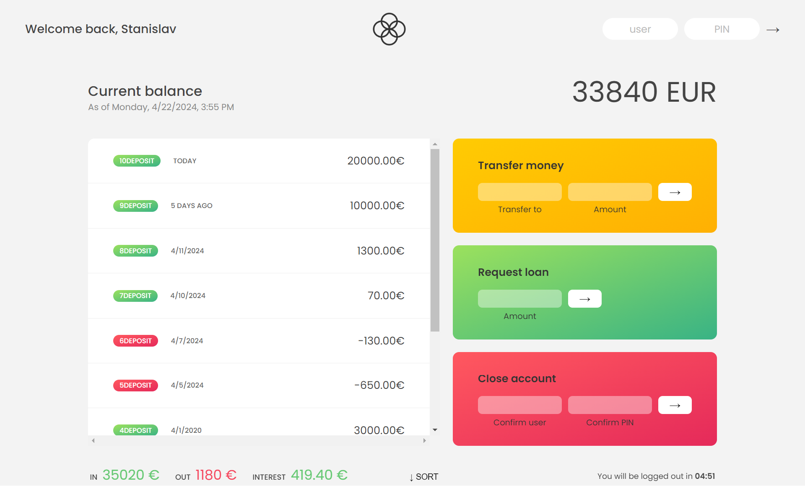

# JS Banking app

### Welcome to the Banking App! This application allows users to perform various banking actions after logging in with their credentials.

- How to Use
- Log In:
- Use the following credentials to log in:
- Username: so
- Password: 5555
- Actions:
- After logging in, you can access your bank account to:
- Apply for a loan
- Send money to another account
- Additional Logins
- You can also log in with the following credentials for demonstration purposes:

- Username: jd
- Password: 2222
- Username: js
- Password: 1111
- Feel free to explore the app using these credentials!
